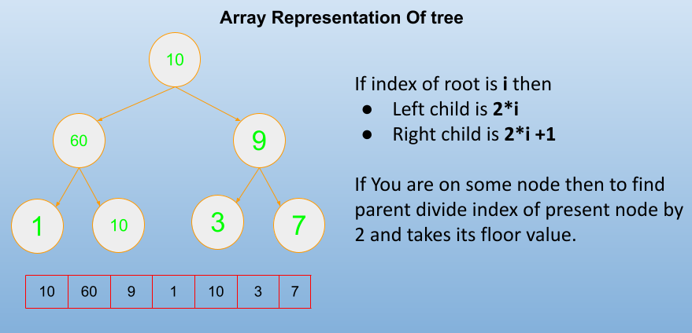
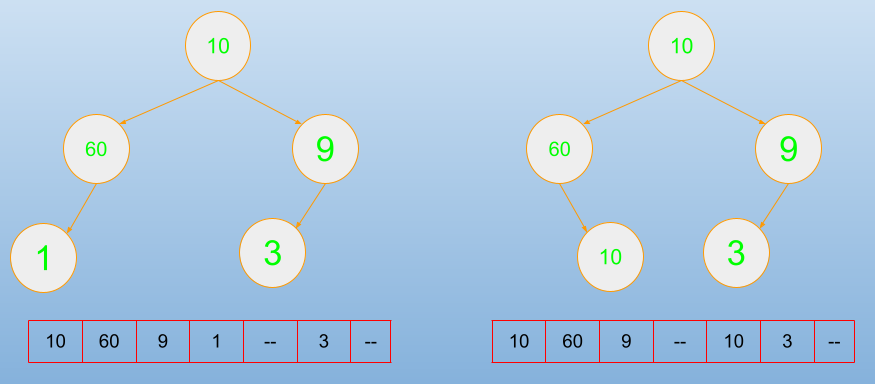
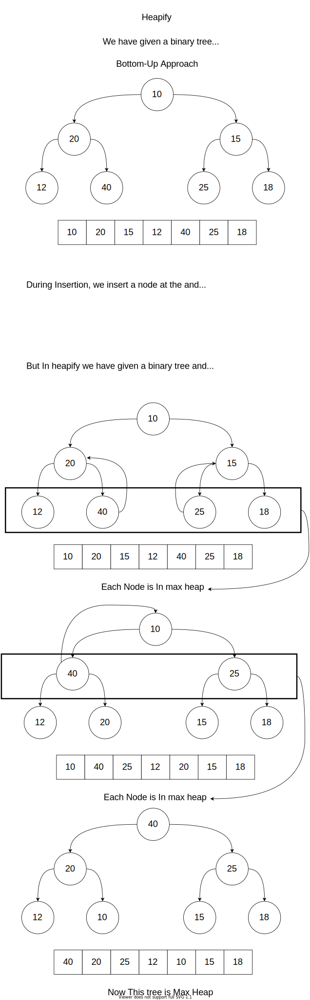

# Heap Sort

| Time Complexity  |            |
| ---------------- | ---------- |
| Best             | O(n log n) |
| Worst            | O(n log n) |
| Average          | O(n log n) |
| Space Complexity | O(1)       |

- It is not an stable algorithm

## Topics

1. Array representation of Binary tree
2. Complete Binary tree
3. Heap
4. Insert and Delete in Heap
5. Heap sort
6. Heapify
7. Priority Queues

## Array Representation of Tree

A tree can be represented using array.

- If root index is i then

  - left child index will be `i*2 +1`
  - right child index will be `i*2 +2`

- if any node index is i then you can reach to root by `floor(i/2)`

- If you want to follow above formula then you must have to put blank if any node is missing

- Fill them level by level

### Full Binary tree

If a binary tree in which each node has either 0 or 2 child

### Complete Binary Tree

is a special type of tree in which every level must be filled completely if not filled then all nodes must be as left as possible

- In an array representation of tree if there are any missing / blank space in between array then it is not a complete binary tree

- height of complete binary tree is log n

# Binary Heap

A binary heap is a complete Binary tree where items are stored in a special order such that the value of parent node is always greater or less than the values of its children.

### Max Heap

Every Node in a tree having greater value then its decedents

- For each sub tree root value is largest

### Min Heap

Every Node in a tree having lesser value then its decedents

- For each sub-tree root has minimum value

  

## Insertion in Heap

- Insertion in heap takes 1 to log n time
- Maximum steps required to adjust the instead element is equals to height of tree

## Delete in Heap

- Deletion in Heap only occurs at root.
- During deletion we have to swap root with the last inserted node in heap
- Time take to delete will be log n
- From max heap whenever you delete you get largest value.

  

## Heap Sort

Heap sort is a comparison based sorting technique based on Binary heap data structure.

- It is similar to selection sort algorithm where we find minimum and place it on the right position.

### Heap sort Algorithm for sorting in ascending order.

1. Build a max heap from input data.

2. Delete the element one by one from max heap and after each deletion you must adjust all the elements in tree such that it is a max heap

3. repeat step-2 until tree is not empty

## Analysis of Heap

1. Create a heap from a given set of numbers (insertion in heap)

## Heapify

- Heapify is a Bottom-Approach

