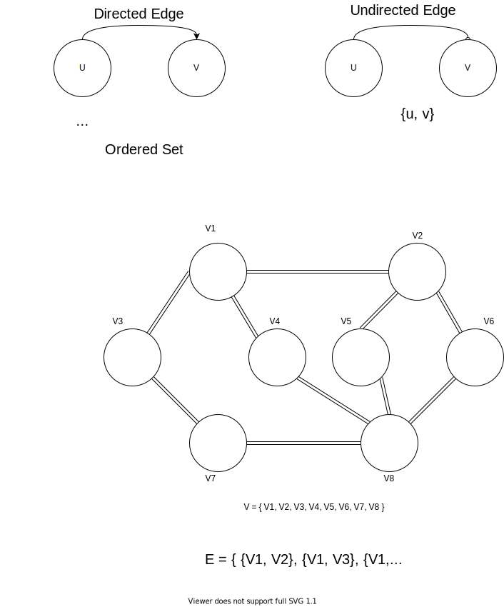
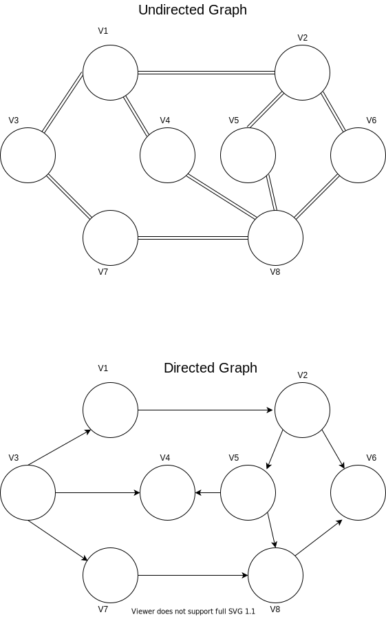
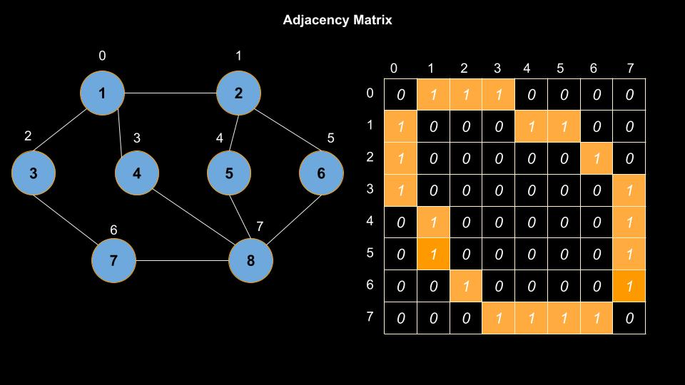
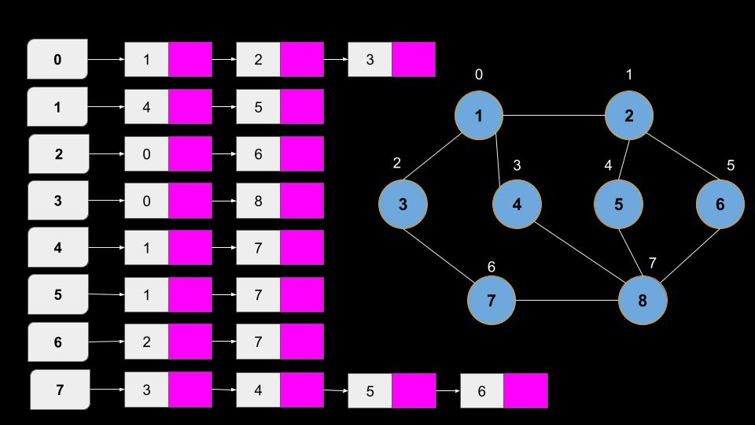

<h1><center>Graph</center></h1>

**Non-Linear Data Structure**

A Graph is a collection of Nodes/Vertices and Edges.

In a tree If there is N nodes then at most n-1 Edges can be.

The study os graph is called as Graph theory.

### Definition of Graph

A graph **G** is an ordered pair of set **V** of vertices and a set **E** of edges.

**Ordered Pair :** In ordered pair order matters (a,b) not equals to (b,a)

**Unordered Pair :** Unordered pair is a set of some thing {a,b} where it can be written as {b,a}

```
// Ordered pair of Vertices and Edges
G = (V, E)
```

**Edge :** Link between two vertices is simply called edge. Edge can be of two types:

- Directed Edge : In this case direction if predefined
- Undirected Edge : In this cas direction is not given



## Types of Graph

**There are two type of Graph On the basic of direction**

1. Directed Graph/ Digraph
2. Undirected Graph



## Simple Application Of Graph

### Social Networks

A social Network Like Facebook is a good example of graph.

- In these type of model the graph is undirected which means bidirectional.
- If you are my friend then i am also your friend.

`TODO`: Write a Project to recommend Friend in a graph Data structure

- If A and B are friend then find all other friends of A and recommend to B and Vice Versa

### World Wide Web(internet)

Lets Take very simple example if you searched for Graph theory on internet and found a site and then you click on that it have lots of other links and that link can be thought as edges and each may of may not have links for all other pages on that site and each page can be thought as Node.

**There are Two types of graph in terms of Weight**

1. Weighted Graph
2. Unweighted Graph

Imagine a Graph representing road then we must have to consider pair of cities and the road between them is edge and in this cas edge must have some value and when we assign value to the node then it is called weighed graph.

In case of Unweighed graph We assume that weight of Each edge is equal and say 1.

- Road Network is a weighted undirected Graph.
- Social Network is Unweighed Undirected Graph.
- World Wide Web is Unweighed Directed Graph.

We can alway consider undirected graph as directed because each pair have both edge present to go.

## Properties of Graph 😠

1. **Self loop in Graph: 💱** An edge pointing to itself is called Self loop.In a web page if we are on certain page then we can still have link for present

2. **MultiEdge : 🥵** A city A to City B have Multiple Flights


3. **Dense Graph :** If Number of edges is Maximum to the graph.

4. **Sparse Graph :** If Number of edges is Minimum or very less

5. **Number of Edges :**

```
if |V| = n

then,

0<= |E| <= n(n-1), if directed
0<= |E| <= n(n-1)/2, if undirected
```

6. **Path :** A sequence of vertices where each adjacent pair is connected by an edge.

   <A, B, F, H>

7. **Simple Path :** A path in which no vertices (and thus no edges) are repeated.

   - <A, B, F, H> <--- Simple Path

   - <A, B, F, H, A, B> <---Here Vertices are repeated so not a simple path

8. **Trail :** A walk in which no edges are repeated.

   **Note:** We Will Generally Focus on Simple Path while dealing with graph.

9. **Strongly Connected Graph :** If there is a path from any vertex to any other vertex.

   - If We have vertex A, B, C then there must be a path such that we can go from A--->B, A--->C, B---> C and so on.

   

   - In Undirected Graph There is no term strongly connected because direction is not specified.

10. **Cycle :** Starts and Ends at same Vertex in a graph then it is called a cycle. In cycle no vertices will be repeated.

11. **Close Walk :** Start and End at same Vertices.

12. **Acyclic Graph :** A graph with no cycle.
    - A tree is an Acyclic Graph.

## Representation Of Graph

There are two Very famous way to Represent Graph

1. Adjacency Matrix
2. Adjacency List

### Adjacency Matrix

It is a 2D array of size `V x V` where V is No of Vertices in a Graph. If the Name of Matrix is adj[][] then adj[i][j] = 1 indicates an edge from vertex i to j.

- Adjacency Matrix for Undirected Graph is always Symmetric.

- For a weighted Graph the value of each a[i][j] = w



**Pros :**

- Easier To implement
- Deletion of edge takes O(1) time

**Cons :**

- It Consumes more Space
- Most of the matrix are Sparse Matrix
- space Complexity is O(V<sup>2</sup>)

### Adjacency List

In This case An Array of List is Used. The size of array is equal to the number of vertices. Let the array be an array[]. An entry array[i] represents the list of vertices adjacent to the ith vertex.

This representation can be used to represent weighted graph.

The weight of edge can be represented as list of pairs.



## Implementation Of Graph

1. Adjacency Matrix

2. Adjacency List

3. All Adjacent Node Of Of given Vertices

4. DFS Traversal

5. BFS Traversal
