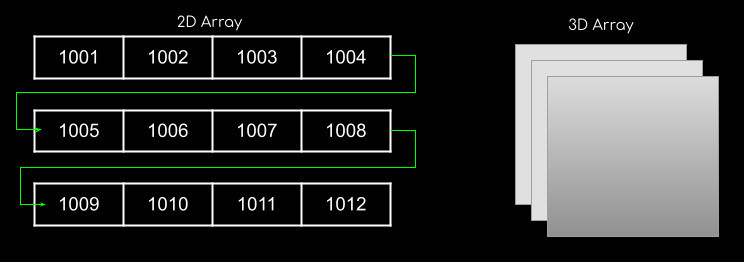

# Arrays

- A collection of items having same datatype stored in a contiguous memory location.

- A array is derived datatype in c programming which can store similar type of data in contiguous memory location.data may be premitive type(int, char, float, double), address of union, structure, pointer, function or another array.

### Properties of Array

- Each element is of the same size (char = 1bye, int = 1 word)
- Element are stored contiguously, with the first element stored at the smallest memory address.

- Array is usefull when we have to store large number of data of similar type.

- Array of char is string

```C
char *str;
```

### Pointer to array

A pointer which holds base address of an array or address of any element of an array is known as pointer to array.

```C
#include <stdio.h>
int main()
{
    int arr[5] = {1, 2, 3, 4, 5};
    int *ptr1 = arr;
    int i;
    for (int i = 0; i < 5; i++)
    {
        printf("%d\t", *(ptr1 + i));
    }
}
//---> Output: 1    2   3   4   5
```

#### Coulumn Major Ordering :

- columns are all together.

  | 0,0 | 1,0 | 2,0 | 3,0 |
  | --- | --- | --- | --- |

```
 LOC(A[j,k])= Base(A)+w[M(k-1)+(j-1)]
```

**Q- A[-5...+20][25...75], base address(BA) = 999, size of element = 10 bytes.Find the location of A[0][74].**

```
LOC(A[0][74]) = 999 + ((74-25)((20-(-5)+1)+(0-(-5))))*10
= 999 + (49 x 26 +5)
= 999 + 12790 = 13789
```

## Multidimentional Array

C allows array of two or more dimensions and maximum number of dimension a C program can have is depend upon compiler.



## Upper Triangular Matrix

A upper triangular matrix U of form

Uij = a[i,j] for i<= j

Uij = 0 for i>j
