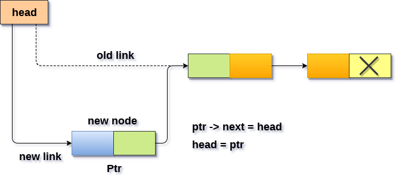
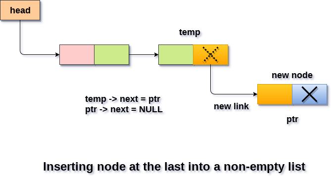
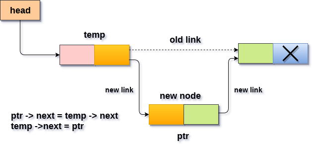

# Linked List

A linked list a data stucture to overcome the limitations of array.

> Linked list can grow as per need

### Representation of LL

```
     Head
+-----+------+   +---+-----+   +----+----+
|  1  |  124 |-->| 4 | 248 |-->| 7  |  0 |--->NULL
+-----+------+   +---+-----+   +----+----+
 100              124           248
```

### Structure of LL

```C++
struct Node
{
    int data;//4 byte
    Node* next;//--> address of the head node gives us access to the complete list
}
```

### Time Complexity

- Access : O(n)
- Insertion : O(n)
- Delete : O(n)

### Array Vs Linked List

|                     | Array                                              | Linked List                                           |
| ------------------- | -------------------------------------------------- | ----------------------------------------------------- |
| Cost of access      | O(1)                                               | O(n)                                                  |
| Memory Requirements | Fixed Size<br>Unused memory                        | No Unused memory<br>Extra memory for pointer variable |
| cost of insertion   | begining: O(n)<br>end : O(1)<br>n-th position:O(n) | begining : O(1) <br> end :O(n)<br> n-th position:O(n) |
| Easy to Use         | Easy                                               | More Prone to error                                   |

## Insertion At Begining

> It is 4 Step process:

1.  Create a new Node
2.  Put in data in Node
3.  Make next of new Node as head
4.  Now assign new Node as head



```c++
void push(int data)
{
    //1. create a new node
    Node *new_node = new Node();
    //2. add data to the node
    new_node->setData(data);
    //3.set next of new_node as head
    new_node->setNext(head);
    //set new_node as head
    head = new_node;
}
```

## Insertion At end

> It is a 5 step process

1. Allocate new Node
2. Put in data
3. Assign next as NULL for last element in list
4. Check if list is empty then make new Node as head
5. else traverse through the last node



```c++
void append(int data)
{
    //1. Allocate new node
    Node *new_node = new Node();
    //2. Add data to neew node
    new_node->setData(data);
    //3. set next as NULL
    new_node->setNext(NULL);
    //4. check if list is empty
    if (head == NULL)
    {
        head = new_node;
        return;
    }
    //5. if list is non empty
    else
    {
        Node *temp = head;
        while (temp->getNext() != NULL)
        {
            temp = temp->getNext();
        }
        temp->setNext(new_node);
        return;
    }
}
```

## Insertion after a giveen Node

> It is a 5 Step Process(insert a node after given node):

1. check if the given node is NULL
   - True : return
   - false : continue
2. Allocate new node
3. put in the data in new node
4. make next of new node as next of prev node
5. make next of prev node as new node



```C++
void insertAfter(Node *prev, int data)
{
    //1. check if given node is NULL
    if (prev == NULL)
    {
        cout << "Prev pointer is null so it may be possible that list is empty so insertion is not possible";
        return;
    }
    //2. allocate new node
    Node *new_node = new Node();
    //3. set data of new_node
    new_node->setData(data);
    //4. set next of new node
    new_node->setNext(prev->getNext());
    //set next of prev as new node
    prev->setNext(new_node);
}
```
