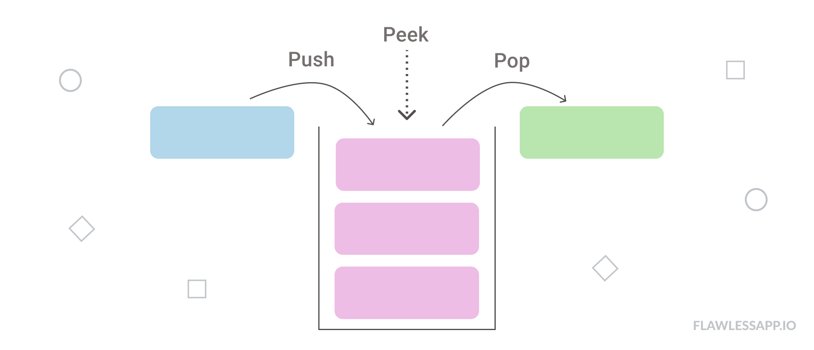

# Stack

A stack is an ordered list in which all insertions and deletions are made at one end, called the **top**.

- Last In First Out List

## Operation On stack

- Push : To add an element to the stack.
- Pop : To remove element from the stack.
- Peek : To look at element without removing them.
- LIFO

### Visual Representation of stack


### Consider the stack With following details

| Field                            | Value |
| -------------------------------- | ----- |
| Size of stack                    | 6     |
| Max value/index of stack top     | 5     |
| Minimum index of stack           | 0     |
| value of top when stack is empty | -1    |
| Value of top when stack is full  | 5     |

## PUSH OPERATION

- Adding element into the TOP of stack

- PUSH is a two step process
  - Increse top
  - add element on top
- Before PUSH always check if stack is full or not
- If stack is full then if we PUSH then it causes Stack Overflow.

### Algorithm to Push

```
procedure push(item:items);
{
    add item to the global stack,
    top is current top of stack,
    n is maximum size of the stack
}

begin:
    if top = n then stack is full and return
    else
        top  = top+1
        stack[top] = item
end:{of push}
```

## Peek Operation

- Return item at the3 top of the stack
- This can also in _underflow_ if stack is empty.
  

### Algorith to Peek

```
peek(satck,top)
begin
  /*check if stack is empty*/
  if(top == -1) then
    print 'Underflow'
    return 0
  else
    return stack[top]
end
```

## Application of Stack

- Evaluation of Arithmatic expressions.

  - Postfix
  - Prefix

- infix to postfix
- usefull in recursive program
- Stack is usefull for desining compiler in operating system to store local variable inside fuctional block.
- A stack(memory stack) can be used in function calls including recursion.
- Reversing data
- Reverse a list
- Convert decimal to binary

## Must do questions On Stack

### [For Answer](https://medium.com/techie-delight/stack-data-structure-practice-problems-and-interview-questions-9f08a35a7f19)

- Stack implementation using an array — C, C++, Java, Python

- Stack Implementation using a Linked List
- Implement a stack using the queue data structure
- Implement a queue using the stack data structure
- Design a stack that returns the minimum element in constant time
- Design a stack that returns a minimum element without using an auxiliary stack
- Implement two stacks in a single array
- Recursive solution to sort a stack
- Reverse a stack using recursion
- Reverse a string using a stack data structure
- Check if an expression is balanced or not
- Find duplicate parenthesis in an expression
- Evaluate a postfix expression
- Decode a given sequence to construct a minimum number without repeated digits
- Merging Overlapping Intervals
- Convert an infix expression into a postfix expression
- Find the next greater element for every element in a circular array
- Find the next greater element for every array element
- Find the previous smaller element for each array element
- Reverse an array in C++
- Longest Increasing Subsequence Problem
- Find all elements in an array that are greater than all elements to their right
- Iterative Implementation of Quicksort
- Find all binary strings that can be formed from a wildcard pattern
- Find the length of the longest balanced parenthesis in a string
- Reverse text without reversing individual words
- Reverse a string without using recursion
- Inorder Tree Traversal
- Preorder Tree Traversal
- Postorder Tree Traversal
- Check if two binary trees are identical or not
- Find ancestors of a given node in a binary tree
- Iteratively print the leaf to root path for every leaf node in a binary tree
- Find preorder traversal of a binary tree from its inorder and postorder sequence
- Construction of an expression tree
- Print complete Binary Search Tree (BST) in increasing order
- Depth First Search (DFS)
- Check whether the leaf traversal of given binary trees is the same or not
- Reverse level order traversal of a binary tree
- Invert Binary Tree
- Invert alternate levels of a perfect binary tree
- Depth-First Search (DFS) vs Breadth-First Search (BFS)
-

```
Q1. Explain Why stack is a recursive datastructure.
```

A stack is a recursive data structure, so it's

a stack is either empty or it consists of a top and the rest which is a stack by itself.

```
Q2. Why and when should I use Stack or Queue data structures instead of Arrays/Lists?
```

Because they help manage your data in more a particular way than arrays and lists.

It means that when you're debugging a problem, you won't have to wonder if someone
randomly inserted an element into the middle of your list, messing up some
invariants.

Arrays and lists are random access. They are very flexible and also easily corruptible. If you want to manage your data as FIFO or LIFO it's best to use those, already implemented, collections.

More practically you should:

- Use a queue when you want to get things out in the order that you put them in (FIFO)
- Use a stack when you want to get things out in the reverse order than you put them in (LIFO)
- Use a list when you want to get anything out, regardless of when you put them in (and when you don't want them to automatically be removed).

```
Q3. Why Are Stacks Useful?
```

They’re very useful because they afford you constant time O(1) operations when inserting or removing from the front of a data structure. One common use of a stack is in compilers, where a stack can be used to make sure that the brackets and parentheses in a code file are all balanced, i.e., have an opening and closing counterpart. Stacks are also very useful in evaluating mathematical expressions.

```
Q4.How to implement Linked List Using Stack?
```

You can simulate a linked list by using two stacks. One stack is the "list," and the other is used for temporary storage.

- To add an item at the head, simply push the item onto the stack.
- To remove from the head, pop from the stack.
- To insert into the middle somewhere, pop items from the "list" stack and push them onto the temporary stack until you get to your insertion point. Push the new item onto the "list" stack, then pop from the temporary stack and push back onto the "list" stack. Deletion of an arbitrary node is similar.

<center> Learn Every day <span> &#169 </span> Avinash Kumar jha 2021</center>
