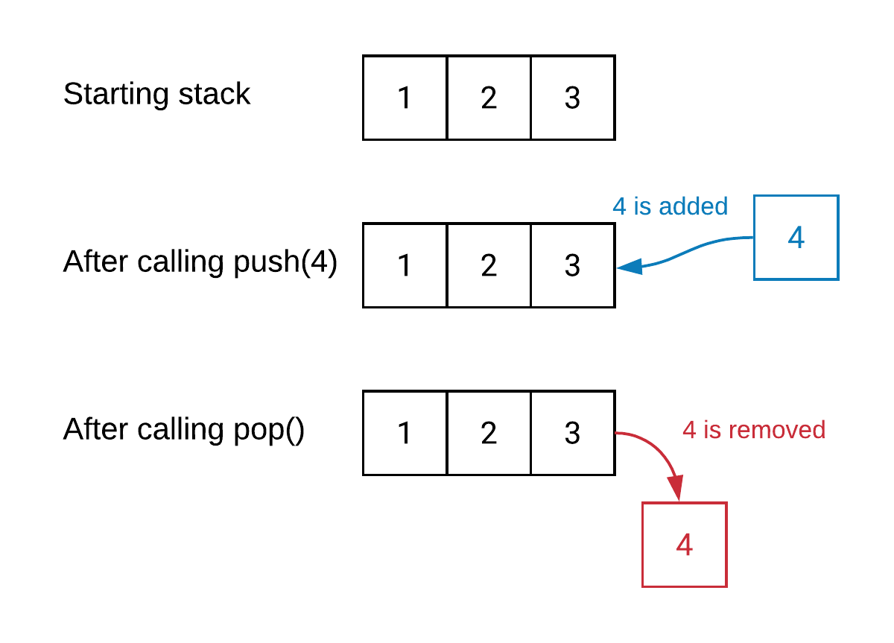
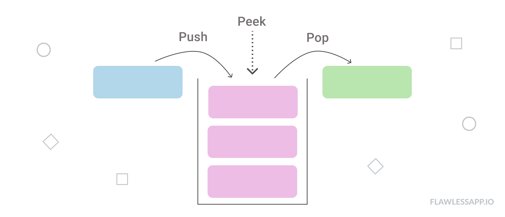

# Stack

A stack is an ordered list in which all insertions and deletions are made at one end, called the **top**.

- Last In First Out List

## Application of Stack

- Function call and recursion
- Undo operation in text editor
- Compiler varify parentheses are balanced or not

## Operation On stack

- Push : To add an element to the stack.
- Pop : To remove element from the stack.
- Peek : To look at element without removing them.
- LIFO

### Visual Representation of stack



### Consider the stack With following details

| Field                            | Value |
| -------------------------------- | ----- |
| Size of stack                    | 6     |
| Max value/index of stack top     | 5     |
| Minimum index of stack           | 0     |
| value of top when stack is empty | -1    |
| Value of top when stack is full  | 5     |

## PUSH OPERATION

- Adding element into the TOP of stack

- PUSH is a two step process
  - Increse top
  - add element on top
- Before PUSH always check if stack is full or not
- If stack is full then if we PUSH then it causes Stack Overflow.

### Algorithm to Push

```
procedure push(item:items);
{
    add item to the global stack,
    top is current top of stack,
    n is maximum size of the stack
}

begin:
    if top = n then stack is full and return
    else
        top  = top+1
        stack[top] = item
end:{of push}
```

## Peek Operation

- Return item at the3 top of the stack
- This can also in _underflow_ if stack is empty.
  

### Algorith to Peek

```
peek(satck,top)
begin
  /*check if stack is empty*/
  if(top == -1) then
    print 'Underflow'
    return 0
  else
    return stack[top]
end
```

## Application of Stack

- Evaluation of Arithmatic expressions.

  - Postfix
  - Prefix

- infix to postfix
- usefull in recursive program
- Stack is usefull for desining compiler in operating system to store local variable inside fuctional block.
- A stack(memory stack) can be used in function calls including recursion.
- Reversing data
- Reverse a list
- Convert decimal to binary

```C++
#include <iostream>
#include <stack>
using namespace std;
int main()
{
    stack<int> stack;
    stack.push(5);
    stack.push(6);
    stack.push(7);
    stack.push(8);

    while (!stack.empty())
    {
        cout << ' ' << stack.top();
        stack.pop();
    }
}
```
