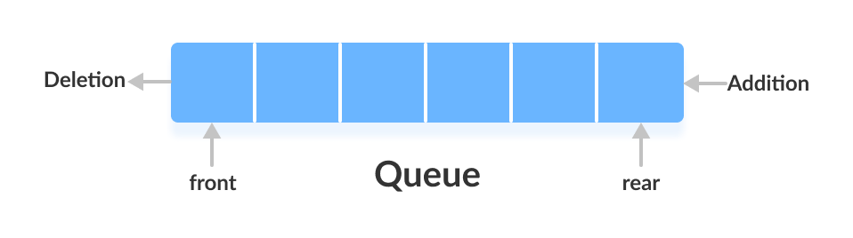

# Queue

A queue is an ordered list in which all insertion at one end called _**REAR**_ and deletion are made at another end called _**FRONT**_

- queue are some times referred as first in first out (**FIFO**)



## Operation

Queue Perform mainly two operation

1. Enqueue - Insertion of items at the rear end of queue

```c++
void Enqueue(int x);
``

2. Dequeue  - Deletion of item from front end and returns it to user
```

```c++
int Dequeue();
```

3. Peek/Front
4. rear
5. isEmpty
6. isFull

- time complexity of all these are O(1)

## Where can we use Queue

Queue is most often use in a scenario where there is a shared resource that can server request but it can serve one at a time in such case queuing request can help .

- Like in javascript event loop pushes the async code into callback queue such that single thread can handle async code in a proper manner of first in first out.

- Printer can handle one request at a time so queue the request is the solution

- In operating system scheduling of process is a good example of queue

## Implementation of Queue

Queue can be implemented using Array or Linked-List

### Array based implementation

1. Take an array A[10]

2. front <----- -1

3. Rear <------ -1

4. isEmpty

```c
isEmpty(){
    if (front == -1 && rear == -1){
        return true;
    } else{
        return false;
    }
```

5.enqueue

```C
enqueue(int x){
    if(isFull())
        return
    else if (isEmpty){
        front = 0;
        rear = 0;
    }else{
        rear = rear +1;
    }
    arr[rear] = x;
}
```

6. dequeue

```c
dequeue(){
    if(isEmpty()){
        return
    }else if (front == rear){
        front = -1;
        rear = -1;
    }else{
        front = front -1;
    }
}
```

## Circular interpretation of queue

In an array implementation when we dequeue from the array the that dequeued position will remain empty for all time in the queue to overcome this problem we implemented circular queue

if current position is i then

- Next-position = (i + 1) % N

- Previous Position = ( i + N -1) % N

### operations on Circular queue

1. isEmpty

```c
isEmpty(){
    if (front = -1 && rear == -1){
        return true;
    }else{
        return false;
    }
}
```

2. enqueue

```c
enqueue(int x){
    if((rear+1)%N == front){
        return
    }else if(isEmpty()){
        front = 0;
        rear = 0;
    }else{
        rear = (rear+1)%N;
    }
    arr[rear] = x;
}

```

3. dequeue

```C
dequeue(){
    if(isEmpty()){
        return
    }else if ( front == rear){
        front  = -1;
        rear = -1;
    }else{
        front  = (front+1)%N;
    }
}
```

All operation in circular queue is also taking constant time

Time Complexity -- O(1)


