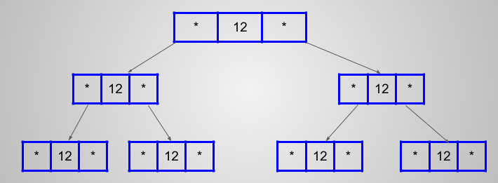

# 🌳 Tree

Tree can be called recursive data structure.

- Recursion is reducing a problem in self similar manner

Before tree we discussed linear data structure like Array, Link list, Stack, Queue.

Tree is a hierarchical data structure.

A tree is a finite non empty set of elements in which the parent elements is called **root** and remaining element are positioned into M>=0 disjoint subsets, each of which it self is a tree.

- Each element is called node of the tree
- forest is an ordered set of ordered tree

- In a tree with N nodes there will be N-1 edges

- **Depth of tree** : length of path from root to x.No of edges in path from root to x.

- **height of tree** : No of edges in longest path from root to a leaf.

## Application of Tree

- If you need to store data in hierarchical order than you need to implement using tree

- File managers are implemented using tree

- Tree is efficient in searching when it is binary tree

- we can insert and delete key in moderate time which is less than array

- Javascript DOM is based on tree

- Html is basses on tree

- B-tree and B+ tree are used for indexing in database

- syntax tree used in compiler

## ✌️ Binary Tree ✌️

A tree in which each node can have at most 2 children


- **Strict binary tree** : A binary tree is proper/ strict if each node has 0 or 2 children

- **Complete Binary tree** : All leaves except possibly the last are completely filled and all nodes are as left as possible.

- **Maximum nodes in some level**: if the given level no is i than max node can be 2<sup>i</sup>

- **Perfect Binary Tree**: if all levels of a binary tree are completely filled than that is perfect binary tree.

- **Maximum no of nodes in a binary tree with height h**

  => 2<sup>0</sup> + 2<sup>1</sup>+ 2<sup>2</sup>+ 2<sup>3</sup>+....+ 2<sup>h</sup>

  => 2<sup>h+1</sup> -1

  => 2<sup>no of levels</sup> -1

- **Balance Binary tree**: Difference between height of left and right subtree for every node is not more than k (mostly 1)

### Implementation Idea of Binary tree



> Node of a Binary tree

```C++
sruct Node{
    int data;
    Node* left;
    Node* right;
};
```

- In node there are three fields and one is for data and other two is left subtree pointer and right subtree pointer.

## Tree Traversal Inorder, Preorder, Postorder

As we know tree is a linear data structure and hence we can not directly iterate over the data we have to follow certain convention such that user can understand the generated output.


**Depth First Traversal**

- Inoder (left, root, right)
  ```
  4 2 5 1 3
  ```
- Preorder ( root, left, right )

  ```
  1 2 4 5 3
  ```

- Postorder ( left, right, root)
  ```
  4 5 2 3 1
  ```

### Inorder Traversal

- It gives binary search tree in non sorted order
- first go to leftest leaf than parent of leftest leaf and then right of the parent of leftest leaf

## Binary Search Tree

A binary tree in which for each node, value of all the nodes in left subtree is lesser or equal than the value of nodes in right sub tree.


