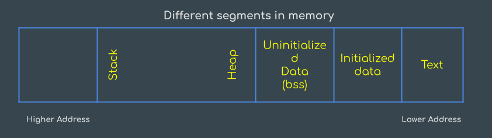

# Programming Methodology

## Data Segment In Memory

The running program stored the machine instructions and data in the same memory space.

- The Memory is logically divided into text and data segment.

- A single text segment is used by modern systems to store program instructions, but to store data need more than one segment.

### Text Segement :

- Text Segemnt contains machine code of the compiled program.
- Text segment are often read only files.
- text segment are frequently shared.

### Initialized Data Segment :

- Initialized data segment store global , static , constant , and variable with extern keyword.
- These data segement are not read only.



```C
#include<stdio.h>
// Global variable stored in initialized segment in r/w area
char c[] = "Avinash";

//global var stored in nitialized data segment read only area
const char p[] = "Happy guy";

int main(){
   //static variable stored in initialized data segment
    static int a = 21;

}
```

### Uninitialized Data Segement (bss) :

- In this segment data is initialized to 0 before program starts executing.
- unintialized data segement starts at the end of data segement and contains all global and static variable.

```C
#include<stdio.h>
char c; /* uninitialize var stored in basic bss */
int main(){
    static int i; /* uninitialized static var stored in bss */
}
```

### Heap :

- Heap segement is used for dyanamic memory allocation.
- Heap segment is shared by all shared libraries and dynamically loaded modules in the program.

```C
//Memory allocating in heap
char *p = (char*) malloc(sizeof(char));
```

### Stack :

- Stack segement is used to store all local var and is used for passing arguments to the functions along with the return address of the instruction which is to be executed after the function is over.

| Code               | solution              |
| ------------------ | --------------------- |
| int i;             | Output:5 6 7          |
| for(i=0;i<3;i++>){ | First iteration a =5  |
| static int a =5;   | second iteration a =6 |
| printf("%d",a++);  | third iteration a =7  |
| }                  |

## Scope Of variable

- In a program scope is the maximum size in which no binding changes.

### static scoping :

- THe determination of scope is done at a time of compilation.

### Dynamic scoping :

- Do not normally have type check at compile time.

## Bitwise operator in C

- & (bitwise AND)

  | 11   | 1 0 1 1 |
  | ---- | ------- |
  | & 12 | 1 1 0 0 |
  | 8    | 1 0 0 0 |

- | (Bitwise OR)

  | 11   | 1 0 1 1 |
  | ---- | ------- |
  | I 12 | 1 1 0 0 |
  | 15   | 1 1 1 1 |

- ^ (Bitwise XOR)
  | 11 | 1 0 1 1 |
  | ---- | ------- |
  | ^ 12 | 1 1 0 0 |
  | 7 | 0 1 1 1 |

  - result of XOR is 1 if two bits are different.

- `<<` (left shift)

  - in other words left shifting an integer `x` with an integer `y` denoted as
    `(x<<y)` is equivalent to multiplying x with `2^y` (2 raised to power y).
    | 11 | 1 0 1 1 |
    | ---- | ------- |
    | << 1 |  
    | 22 | 1 0 1 1 0 |

- `>>`(right shift)

  - n other words right shifting an integer `x` with an integer `y` denoted as `(x>>y)` is equivalent to dividing x with `2^y`.
    | 11 | 1 0 1 1 |
    | ---- | ------- |
    | >> 1 |  
    | 5 | 0 1 0 1 |

- ~ (Bitwise NOT)
  | ~ 11 | 1 0 1 1 |
  | ---- | ------- |  
   | 8 | 0 1 0 0 |

### Some Important points about Bitwise operator

- left shift and right shift should not be used for negetive number.

- if number is shifted morethan the sixe of integer then the result is undefined
- Bitwise operators are not logiacl operators.
- The left shift is eqivalent to multiplication of 2
- the right shift is eqivalent to division of 2
- The & operator is used to check if number is even of odd.

  - if x & 1 != 0 then x is odd
  - if x & 1 == 0 then x is even

| Category       | Operator                          | Associativity |
| -------------- | --------------------------------- | ------------- |
| Postfix        | () [] -> . ++ - -                 | Left to right |
| Unary          | + - ! ~ ++ - - (type)\* & sizeof  | Right to left |
| Multiplicative | \* / %                            | Left to right |
| Additive       | + -                               | Left to right |
| Shift          | << >>                             | Left to right |
| Relational     | < <= > >=                         | Left to right |
| Equality       | == !=                             | Left to right |
| Bitwise AND    | &                                 | Left to right |
| Bitwise XOR    | ^                                 | Left to right |
| Bitwise OR     |                                   | Left to right |
| Logical AND    | &&                                | Left to right |
| Logical OR     | II                                | Left to right |
| Conditional    | ?:                                | Right to left |
| Assignment     | = += -= \*= /= %=>>= <<= &= ^= I= | Right to left |
| Comma          | ,                                 | Left to right |

## Short circuit in logical operator

- In case of logical AND, the second oprand is not evaluated if first operand is false.
- In case of logical or second operand is not evaluated if first operand is true.

## Address arithmatic in C

- We can subtract address of any two variable.
- We can not `+, \, *,` two address.
- We can not +,- an int to an address.
- operators use in address
  - !
  - sizeof
  - Type casting (Type)
  - Logical operator

```C
int a, b;
int c = &a - &b
```

suppose address of a =5000 and address of b = 1000
According to solution 5000 -1000 = 4000

## Value of variable in C

### LValue

- LValue stands for left vale.
- LValue must be a container which have ability to hold data.

### RValue

- Rvalue stands for right value.
- RValue can be a constant, variable, functions which is returning value.

## Break and Continue

### Break

- Task of this keyworf is to bring the control out of the loop in case of looping.
- Break keyworf switch the control from one case to anothercase of switch case control system.

### Continue

- It transfers the control of program at the begining og the loop.
- continue can only be used in loop.
